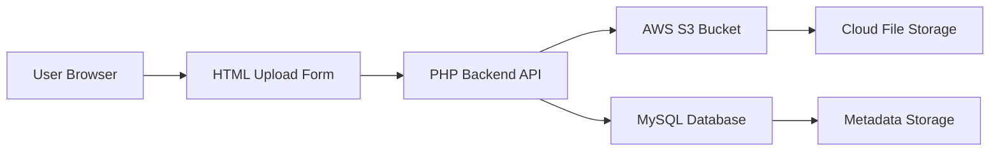
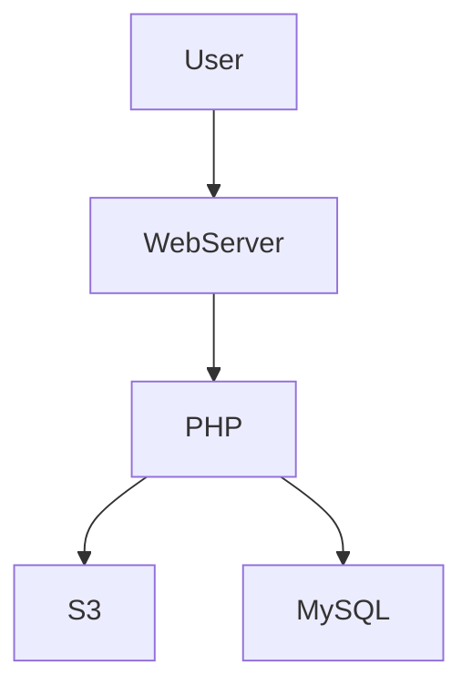
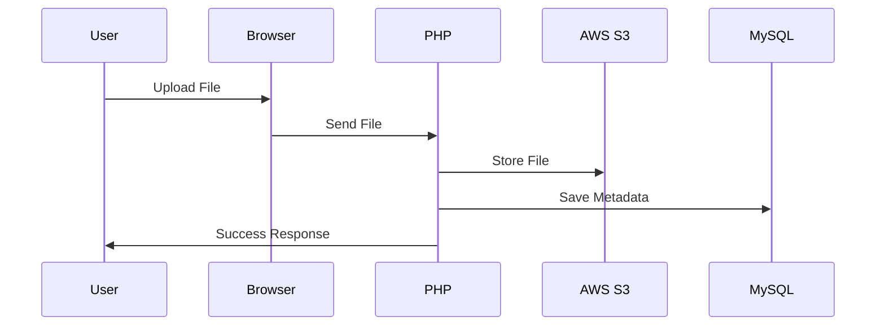

<!-- 🌈 ULTRA TOP BANNER -->

<p align="center">
  
</p>

---

<h1 align="center">🌈🚀 Ultimate Cloud Upload System</h1>
<h3 align="center">AWS S3 + PHP + MySQL | Production Grade Cloud Architecture</h3>

---

<p align="center">


</p>

---

# 🌟 Project Vision

This is not just a project.  
This is a **real-world cloud storage system architecture simulation**.

Designed to demonstrate how modern applications:

✔ Upload files securely  
✔ Store files in Cloud Storage (AWS S3)  
✔ Store metadata in Database (MySQL)  
✔ Maintain scalability + performance  
✔ Follow real production workflows  

---

# 🧠 Real Industry Problem This Solves

Modern applications must:

- Store user files securely
- Scale storage without managing servers
- Track uploaded files in database
- Provide fast global access

This system replicates exactly that.

---

# 🏗️ Full Architecture Diagram



---

# ☁ AWS Cloud Architecture View



---

# ✨ Core Features

🚀 Cloud File Upload  
🔐 IAM Secure Access  
📦 Scalable Cloud Storage  
🗄 Metadata Database Tracking  
⚡ Fast Upload Processing  
📊 Production Ready Structure  

---

# 📂 Enterprise Project Structure

```
/cloud-upload-system
│── index.html
│── upload.php
│── db.php
│── README.md
│── composer.json
│── /vendor
│── /uploads (temp optional)
```

---

# 🧑‍💻 Technology Stack

| Layer | Technology |
|---|---|
Frontend | HTML5 |
Backend | PHP |
Cloud Storage | AWS S3 |
Database | MySQL |
Security | AWS IAM |

---

# 🔧 Step-by-Step Full Setup Guide

---

## 1️⃣ Clone Repository

```
git clone https://github.com/arkantandel
cd project-folder
```

---

## 2️⃣ AWS Setup

### Create S3 Bucket
- Go AWS Console
- Create Bucket
- Disable public block if needed
- Enable Versioning (Optional)

---

### Create IAM User

Give Permissions:
- AmazonS3FullAccess (for testing)

---

## 3️⃣ Install AWS SDK

```
composer require aws/aws-sdk-php
```

---

## 4️⃣ Database Setup

```
CREATE TABLE uploads (
 id INT AUTO_INCREMENT PRIMARY KEY,
 name VARCHAR(255),
 file_path VARCHAR(500),
 created_at TIMESTAMP DEFAULT CURRENT_TIMESTAMP
);
```

---

## 5️⃣ Configure Database Connection

Update db.php

---

## 6️⃣ Configure AWS Credentials

Inside upload.php:

- Access Key
- Secret Key
- Region
- Bucket Name

---

# 📄 Upload Flow Logic



---

# 💻 Core Upload Code (Simplified)

```php
$s3->putObject([
 'Bucket' => 'bucket-name',
 'Key' => $file['name'],
 'SourceFile' => $file['tmp_name'],
 'ACL' => 'public-read'
]);
```

---

# 🧠 What You Learn

✔ Real Cloud Storage Integration  
✔ Backend to Cloud Communication  
✔ Database Metadata Management  
✔ IAM Security Fundamentals  
✔ Production Workflow Thinking  

---

# 🚀 Future Enterprise Enhancements

🔐 User Authentication System  
📁 Folder Based Upload Structure  
📊 Admin Dashboard  
🖼 File Preview System  
📦 Multi Region S3 Replication  

---

# 👨‍💻 Project Owner

## Arkan Tandel  
Cloud & DevOps Engineer 🚀  

GitHub: https://github.com/arkantandel  
LinkedIn: https://linkedin.com/in/arkan-tandel-81709b360  

---

# ❤️ Owner Message

I built this project to simulate real-world cloud storage workflows  
and strengthen hands-on cloud + backend integration skills.

---

# ⭐ Support

If you like this project → ⭐ Star the repository  
If you want to contribute → Pull Requests are welcome  

---

<!-- FOOTER BANNER -->

<p align="center">
  
</p>


